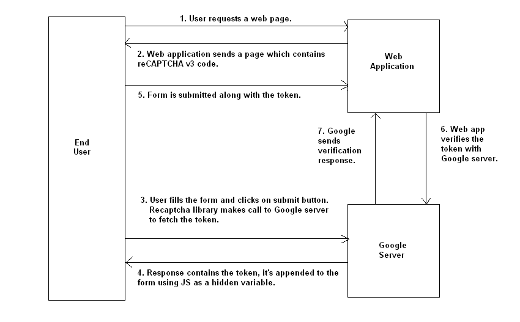
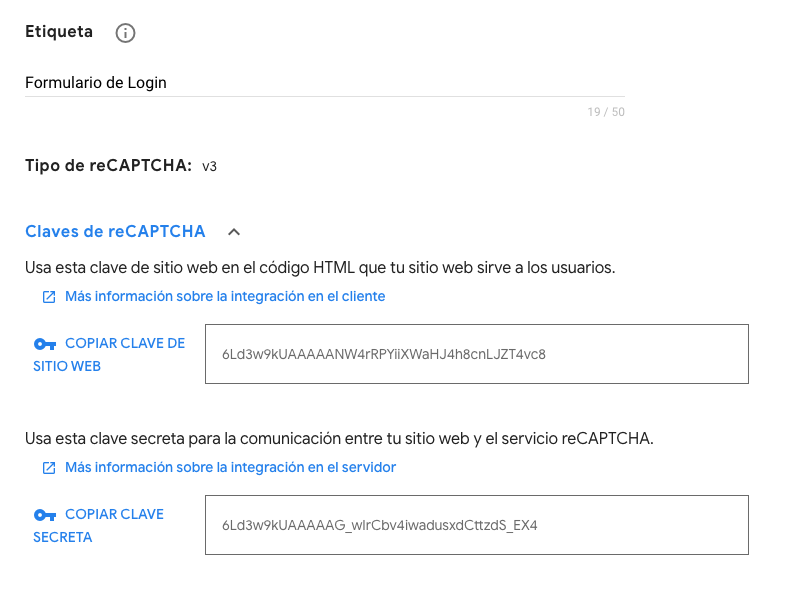
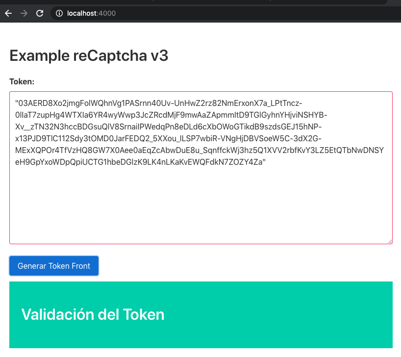

# recaptcha-v3

Ejemplo que implementa reCaptcha v3 de google.


El flujo es el siguiente:




1 .-El usuario final solicita una página web.

2 .- La aplicación o el servidor web devuelven la página solicitada, que incluye código de reCAPTCHA v3.

3 .- A continuación, el usuario rellena el formulario y hace clic en el botón de enviar.

4 .- Antes de enviar los datos del formulario al servidor, el código de reCAPTCHA v3 en el cliente realiza una llamada AJAX al servidor Google y obtiene un token. Lo importante aquí es que tenemos que enviar el atributo action con un valor apropiado durante la llamada AJAX. Debes enviar el valor que identifica a tu formulario. Este es el valor que usarás para la verificación del lado del servidor, junto con otros parámetros.

5 .- El token obtenido en el paso anterior se envía junto con los otros datos del formulario. En la mayoría de los casos agregamos dos variables ocultas al formulario, token y action, antes de enviarlo.

6 .- Una vez que se envía el formulario, tenemos que realizar el paso de verificación para decidir si el formulario es enviado por un humano. Como primer paso, realizaremos una solicitud POST para verificar el token de respuesta. La solicitud POST envía el token junto con la clave secreta de Google al servidor Google.

7 .- La respuesta es un objeto JSON, y lo usaremos para decidir si el formulario ha sido enviado por un humano. El formato del objeto JSON se muestra en el siguiente fragmento de código.

 
[Referencia](https://code.tutsplus.com/es/tutorials/example-of-how-to-add-google-recaptcha-v3-to-a-php-form--cms-33752)
 

 ## Creación de claves 

1 .- Acceder a https://www.google.com/recaptcha/admin/create

2 .- Crear y copiar llaves publica (Front-End) y llave privada (Backend)




# Getting started
- Clonar repositorio

```bash
https://github.com/mortegac/recaptcha-v3.git
```

- Instalar dependencias

```bash
cd recaptcha-v3            // go to the root directory of this project
npm install or yarn install
```

- Build and run the project

```bash
cd recaptcha-v3          // skip this step if you are already inside the root directory
npm start or yarn start
```

.- Ingresar a [http://localhost:4000/](http://localhost:4000/)




